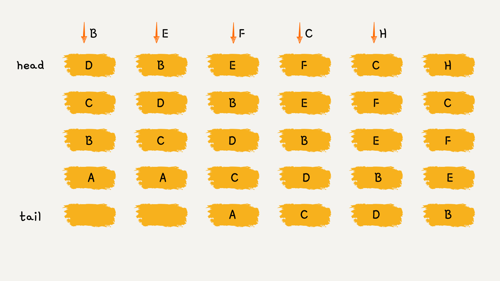

# [16.25. LRU 缓存](https://leetcode.cn/problems/lru-cache-lcci)

🟠 <font color=#ffb800>Medium</font>&emsp; 🔖&ensp; [`设计`](/tag/design.md) [`哈希表`](/tag/hash-table.md) [`链表`](/tag/linked-list.md) [`双向链表`](/tag/doubly-linked-list.md)&emsp; 🔗&ensp;[`LeetCode`](https://leetcode.cn/problems/lru-cache-lcci)

## 题目

<p>设计和构建一个&ldquo;最近最少使用&rdquo;缓存，该缓存会删除最近最少使用的项目。缓存应该从键映射到值(允许你插入和检索特定键对应的值)，并在初始化时指定最大容量。当缓存被填满时，它应该删除最近最少使用的项目。</p>

<p>它应该支持以下操作： 获取数据 <code>get</code> 和 写入数据 <code>put</code> 。</p>

<p>获取数据 <code>get(key)</code> - 如果密钥 (key) 存在于缓存中，则获取密钥的值（总是正数），否则返回 -1。<br>
写入数据 <code>put(key, value)</code> - 如果密钥不存在，则写入其数据值。当缓存容量达到上限时，它应该在写入新数据之前删除最近最少使用的数据值，从而为新的数据值留出空间。</p>

<p><strong>示例:</strong></p>

<pre>LRUCache cache = new LRUCache( 2 /* 缓存容量 */ );

cache.put(1, 1);
cache.put(2, 2);
cache.get(1);       // 返回  1
cache.put(3, 3);    // 该操作会使得密钥 2 作废
cache.get(2);       // 返回 -1 (未找到)
cache.put(4, 4);    // 该操作会使得密钥 1 作废
cache.get(1);       // 返回 -1 (未找到)
cache.get(3);       // 返回  3
cache.get(4);       // 返回  4
</pre>

本题与 LeetCode [第 146 题](../problem/0146.md) 相同。

## 解题思路

`LRU` 是 `Least Recently Used` 的缩写，即最近最少使用，是一种常用的缓存淘汰算法，选择最久未使用的页面予以淘汰。



可以维护一个有序单链表，越靠近链表尾部的节点是越早之前访问的。如上图所示：

- 要插入 B 的时候，发现缓存中有 B ，这时需要把 B 放到链首，因为它被使用了；
- 要插入 E 的时候，缓存中没有 E，直接把 E 插入链首；
- 要插入 F 的时候，缓存中没有 F，容量已满，需要淘汰掉 A ，因为 A 最久未被使用；
- 要插入 C 的时候，发现缓存中有 C ，这时需要把 C 放到链首；
- 要插入 H 的时候，缓存中没有 H，容量已满，需要淘汰掉 D ，因为 D 最久未被使用；

可以发现，LRU 更新和插入新节点都发生在链首，删除数据都发生在链尾。

`LRUCache` 类有两个方法：

- `get` 当有一个新的数据被访问时：
  - 如果此数据之前已经被缓存在链表中了，遍历得到这个数据对应的节点，并将其从原来的位置删除，然后再插入到链表的头部，返回数据的值；
  - 如果此数据没有在缓存链表中，则返回 `-1`；
- `put` 往链表里新增数据时：
  - 如果此数据之前已经被缓存在链表中了，更新此数据的值，并将其从原来的位置删除，再插入到链表的头部；
  - 如果此数据没有在缓存链表中，又分为两种情况：
    - 如果此时缓存未满，则将此节点直接插入到链表的头部；
    - 如果此时缓存已满，则链表尾节点删除，将新的数据节点插入链表的头部。

这样就用链表实现了一个 LRU 缓存，如果使用单向链表实现，则缓存访问的时间复杂度为 `O(n)`，因为不管缓存有没有满，都需要遍历一遍链表。

可以继续优化这个实现思路，比如使用双向链表，并引入 **哈希表（Hash table）** 来记录每个数据的位置，将缓存访问的时间复杂度降到 `O(1)`。

## 代码

```javascript
class Node {
	// @param {number} key
	// @param {number} value
	constructor(key, value) {
		this.key = key;
		this.value = value;
		this.next = null;
		this.prev = null;
	}
}

class LRUCache {
	// @param {number} capacity
	constructor(capacity) {
		this.cap = capacity;
		this.cache = new Map();
		this.head = new Node(0, 0);
		this.tail = new Node(0, 0);
		this.head.next = this.tail;
		this.tail.prev = this.head;
	}

	// @param {number} key
	// @return {number}
	get(key) {
		if (this.cache.has(key)) {
			this.remove(this.cache.get(key));
			this.insert(this.cache.get(key));
			return this.cache.get(key).value;
		}
		return -1;
	}

	// @param {Node} node
	remove(node) {
		const prev = node.prev;
		const next = node.next;
		prev.next = next;
		next.prev = prev;
	}

	// @param {Node} node
	insert(node) {
		const next = this.head.next;
		this.head.next = node;
		next.prev = node;
		node.prev = this.head;
		node.next = next;
	}

	// @param {number} key
	// @param {number} value
	// @return {void}
	put(key, value) {
		if (this.cache.has(key)) {
			this.remove(this.cache.get(key));
		}
		this.cache.set(key, new Node(key, value));
		this.insert(this.cache.get(key));
		if (this.cache.size > this.cap) {
			const old = this.tail.prev;
			this.remove(old);
			this.cache.delete(old.key);
		}
	}
}

/**
 * Your LRUCache object will be instantiated and called as such:
 * var obj = new LRUCache(capacity)
 * var param_1 = obj.get(key)
 * obj.put(key,value)
 */
```
