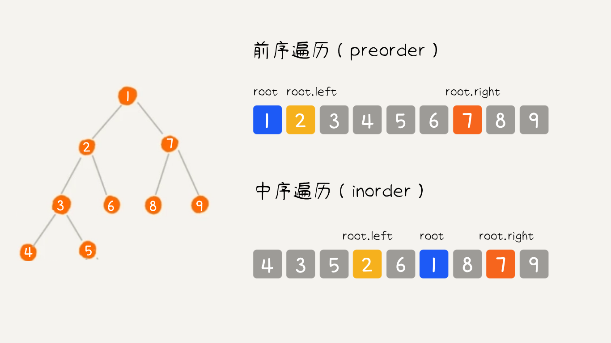

# [7. 重建二叉树](https://leetcode.cn/problems/zhong-jian-er-cha-shu-lcof)

🟠 <font color=#ffb800>Medium</font>&emsp; 🔖&ensp; [`树`](/tag/tree.md) [`数组`](/tag/array.md) [`哈希表`](/tag/hash-table.md) [`分治`](/tag/divide-and-conquer.md) [`二叉树`](/tag/binary-tree.md)&emsp; 🔗&ensp;[`LeetCode`](https://leetcode.cn/problems/zhong-jian-er-cha-shu-lcof)

## 题目

<p>某二叉树的先序遍历结果记录于整数数组 <code>preorder</code>，它的中序遍历结果记录于整数数组 <code>inorder</code>。请根据 <code>preorder</code> 和 <code>inorder</code> 的提示构造出这棵二叉树并返回其根节点。</p>

<p>&nbsp;</p>

<p>注意：<code>preorder</code> 和 <code>inorder</code> 中均不含重复数字。</p>

<p>&nbsp;</p>

<p><strong>示例 1：</strong></p>

<p></p>

<pre>
<strong>输入: </strong>preorder = [3,9,20,15,7], inorder = [9,3,15,20,7]

<strong>输出: </strong>[3,9,20,null,null,15,7]
</pre>

<p>&nbsp;</p>

<p><strong>示例 2:</strong></p>

<pre>
<strong>输入: </strong>preorder = [-1], inorder = [-1]

<strong>输出:</strong> [-1]
</pre>

<p>&nbsp;</p>

<p><strong>提示:</strong></p>

<ul>
	<li><code>1 &lt;= preorder.length &lt;= 3000</code></li>
	<li><code>inorder.length == preorder.length</code></li>
	<li><code>-3000 &lt;= preorder[i], inorder[i] &lt;= 3000</code></li>
	<li><code>inorder</code> 均出现在 <code>preorder</code></li>
	<li><code>preorder</code> 保证 为二叉树的前序遍历序列</li>
	<li><code>inorder</code> 保证 为二叉树的中序遍历序列</li>
</ul>

<p>&nbsp;</p>

本题与 LeetCode [第 105 题](../problem/0105.md) 相同。

<p>&nbsp;</p>

## 解题思路

构造二叉树，第一件事一定是找根节点，然后想办法构造左右子树。

前序遍历结果第一个就是根节点的值，然后再根据中序遍历结果确定左右子树的节点。

不断的递归直到所有的树都生成完成。



递归时直接传入需要的 slice 范围作为输入, 可以避免申请对应 inorder 索引的内存。

## 代码

```javascript
/**
 * @param {number[]} preorder
 * @param {number[]} inorder
 * @return {TreeNode}
 */
var deduceTree = function (preorder, inorder) {
	if (!preorder.length) return null;
	let root = new TreeNode(preorder[0]);
	for (let i = 0; i < preorder.length; i++) {
		if (inorder[i] == preorder[0]) {
			root.left = deduceTree(preorder.slice(1, i + 1), inorder.slice(0, i));
			root.right = deduceTree(preorder.slice(i + 1), inorder.slice(i + 1));
			break;
		}
	}
	return root;
};
```
