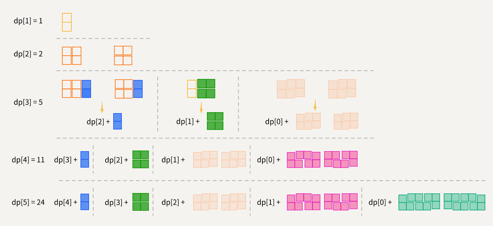

# 790. 多米诺和托米诺平铺

🟠 <font color=#ffb800>Medium</font>&emsp; 🔖&ensp; [`动态规划`](/tag/dynamic-programming.md)&emsp; 🔗&ensp;[`力扣`](https://leetcode.cn/problems/domino-and-tromino-tiling) [`LeetCode`](https://leetcode.com/problems/domino-and-tromino-tiling)

## 题目

You have two types of tiles: a `2 x 1` domino shape and a tromino shape. You
may rotate these shapes.


Given an integer n, return _the number of ways to tile an_ `2 x n` _board_.
Since the answer may be very large, return it **modulo** `109 + 7`.

In a tiling, every square must be covered by a tile. Two tilings are different
if and only if there are two 4-directionally adjacent cells on the board such
that exactly one of the tilings has both squares occupied by a tile.

**Example 1:**


> Input: n = 3
>
> Output: 5
>
> Explanation: The five different ways are show above.

**Example 2:**

> Input: n = 1
>
> Output: 1

**Constraints:**

- `1 <= n <= 1000`

## 题目大意

有两种形状的瓷砖：一种是 `2 x 1` 的多米诺形，另一种是形如 "L" 的托米诺形。两种形状都可以旋转。


给定整数 n ，返回可以平铺 `2 x n` 的面板的方法的数量。**返回对** `109 + 7` **取模** 的值。

平铺指的是每个正方形都必须有瓷砖覆盖。两个平铺不同，当且仅当面板上有四个方向上的相邻单元中的两个，使得恰好有一个平铺有一个瓷砖占据两个正方形。

**示例 1:**


> **输入:** n = 3
>
> **输出:** 5
>
> **解释:** 五种不同的方法如上所示。

**示例 2:**

> **输入:** n = 1
>
> **输出:** 1

**提示：**

- `1 <= n <= 1000`

## 解题思路

这道题的核心在于如何利用动态规划来枚举所有可能的铺法。

如图所示：



- `dp[0] = 1`：空棋盘有一种铺法。
- `dp[1] = 1`：一个 `2 * 1` 的棋盘只能用一个竖直的多米诺骨牌铺满。
- `dp[2] = 2`：两个竖直多米诺骨牌或两个水平多米诺骨牌。
- `dp[3] = 5`：
  - `dp[3] = dp[2] + dp[1] + 2 * dp[0]`
  - 在 `dp[2]` 后面加一个竖直的多米诺骨牌：`2`
  - 在 `dp[1]` 后面加两个水平的多米诺骨牌：`1`
  - 在 `dp[0]` 后面加两个 L 形托米诺骨牌：`2`
- `dp[4] = 11`：
  - `dp[4] = dp[3] + dp[2] + 2 * dp[1] + 2 * dp[0]`
  - 在 `dp[3]` 后面加一个竖直的多米诺骨牌：`5`
  - 在 `dp[2]` 后面加两个水平的多米诺骨牌：`2`
  - 在 `dp[1]` 后面加两个 L 形托米诺骨牌：`2`
  - 在 `dp[0]` 后面加一个水平的多米诺骨牌和两个 L 形托米诺骨牌：`2`
- `dp[5] = 24`：
  - `dp[5] = dp[4] + dp[3] + 2 * dp[2] + 2 * dp[1] + 2 * dp[0]`
  - 在 `dp[4]` 后面加一个竖直的多米诺骨牌：`11`
  - 在 `dp[3]` 后面加两个水平的多米诺骨牌：`5`
  - 在 `dp[2]` 后面加两个 L 形托米诺骨牌：`4`
  - 在 `dp[1]` 后面加一个水平的多米诺骨牌和两个 L 形托米诺骨牌：`2`
  - 在 `dp[0]` 后面加两个水平的多米诺骨牌和两个 L 形托米诺骨牌：`2`

由此可以得到递推关系：

```
dp[n] = dp[n-1] + dp[n-2] +  2 * (dp[n-3] + ... + d[0])
      = dp[n-1] + dp[n-2] + dp[n-3] + dp[n-3] + 2 * (dp[n-4] + ... + d[0])
      = dp[n-1] + dp[n-3] + (dp[n-2] + dp[n-3] + 2 * (dp[n-4] + ... + d[0]))
      = dp[n-1] + dp[n-3] + dp[n-1]
      = 2 * dp[n-1] + dp[n-3]
```

#### 复杂度分析

- **时间复杂度**：`O(n)`，动态规划需要遍历 `n`。

- **空间复杂度**：
  - 常规 DP：需要存储 `n + 1` 个状态，空间复杂度为 `O(n)`。
  - 优化 DP：只需要三个变量，空间复杂度为 `O(1)`。

## 代码

::: code-tabs
@tab 动态规划

```javascript
/**
 * @param {number} n
 * @return {number}
 */
var numTilings = function (n) {
	const MOD = 1e9 + 7;

	let dp = new Array(n + 1).fill(0);
	dp[0] = 1;
	dp[1] = 1;
	dp[2] = 2;

	for (let i = 3; i <= n; i++) {
		dp[i] = (2 * dp[i - 1] + dp[i - 3]) % MOD;
	}

	return dp[n];
};
```

@tab 动态规划（空间优化）

```javascript
/**
 * @param {number} n
 * @return {number}
 */
var numTilings = function (n) {
	const MOD = 1e9 + 7;

	if (n === 0) return 1;
	if (n === 1) return 1;
	if (n === 2) return 2;

	let dp0 = 1,
		dp1 = 1,
		dp2 = 2;

	for (let i = 3; i <= n; i++) {
		let curr = (2 * dp2 + dp0) % MOD;
		dp0 = dp1;
		dp1 = dp2;
		dp2 = curr;
	}

	return dp2;
};
```

:::
