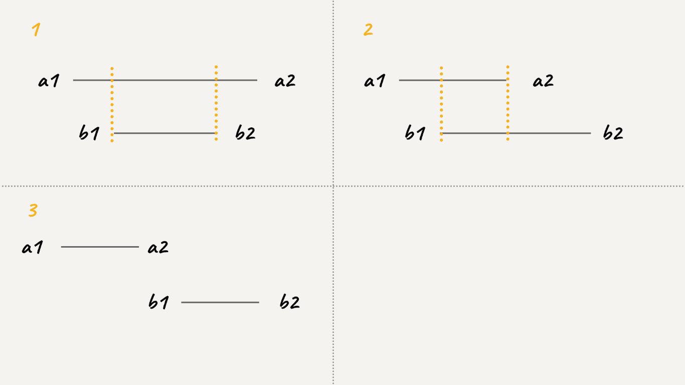

# 1288. 删除被覆盖区间

🟠 <font color=#ffb800>Medium</font>&emsp; 🔖&ensp; [`数组`](/tag/array.md) [`排序`](/tag/sorting.md)&emsp; 🔗&ensp;[`力扣`](https://leetcode.cn/problems/remove-covered-intervals) [`LeetCode`](https://leetcode.com/problems/remove-covered-intervals)

## 题目

Given an array `intervals` where `intervals[i] = [li, ri]` represent the
interval `[li, ri)`, remove all intervals that are covered by another interval
in the list.

The interval `[a, b)` is covered by the interval `[c, d)` if and only if `c <=
a` and `b <= d`.

Return _the number of remaining intervals_.

**Example 1:**

> Input: intervals = [[1,4],[3,6],[2,8]]
>
> Output: 2
>
> Explanation: Interval [3,6] is covered by [2,8], therefore it is removed.

**Example 2:**

> Input: intervals = [[1,4],[2,3]]
>
> Output: 1

**Constraints:**

- `1 <= intervals.length <= 1000`
- `intervals[i].length == 2`
- `0 <= li < ri <= 10^5`
- All the given intervals are **unique**.

## 题目大意

给你一个区间列表，请你删除列表中被其他区间所覆盖的区间。

只有当 `c <= a` 且 `b <= d` 时，我们才认为区间 `[a,b)` 被区间 `[c,d)` 覆盖。

在完成所有删除操作后，请你返回列表中剩余区间的数目。

## 解题思路

1.  按照区间的起点进行升序排序，若起点相同时按照区间的终点进行降序排列；
2.  排序之后，两个相邻区间可能有如下三种情况：



- 对于情况一，找到了一个覆盖区间，`count ++`；
- 对于情况二，两个区间可以合并，更新终点（因为区间已按起点升序排序，所以只需要更新终点）；
- 对于情况三，两个区间完全不相交，更新起点和终点；

3. 最后返回总区间数减去覆盖区间数 `intervals.length - count`；

## 代码

```javascript
/**
 * @param {number[][]} intervals
 * @return {number}
 */
var removeCoveredIntervals = function (intervals) {
	// 按照起点升序排列，起点相同时，按终点降序排列
	intervals.sort((a, b) => {
		if (a[0] == b[0]) {
			return b[1] - a[1];
		}
		return a[0] - b[0];
	});

	// 记录合并区间的起点和终点
	let left = intervals[0][0],
		right = intervals[0][1],
		count = 0;

	for (let i = 1; i < intervals.length; i++) {
		let item = intervals[i];
		// 情况一，找到覆盖区间
		if (right >= item[1]) {
			count++;
		}
		// 情况二，找到相交区间，更新终点
		if (right >= item[0] && right <= item[1]) {
			right = item[1];
		}
		// 情况三，完全不相交，更新起点和终点
		if (right < item[0]) {
			left = item[0];
			right = item[1];
		}
	}
	return intervals.length - count;
};
```
